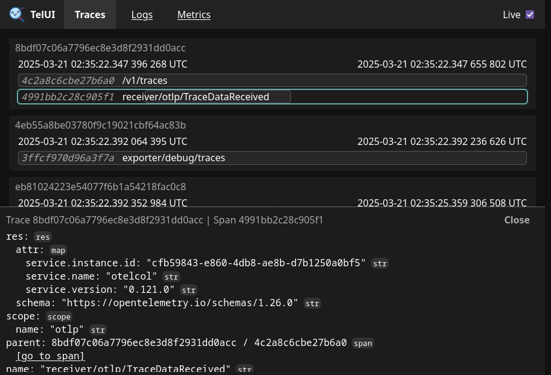
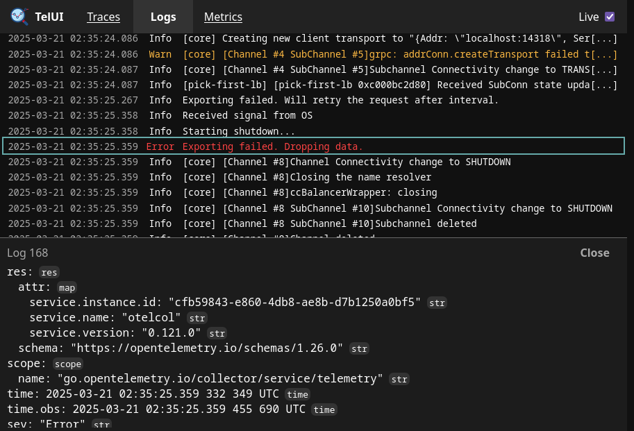
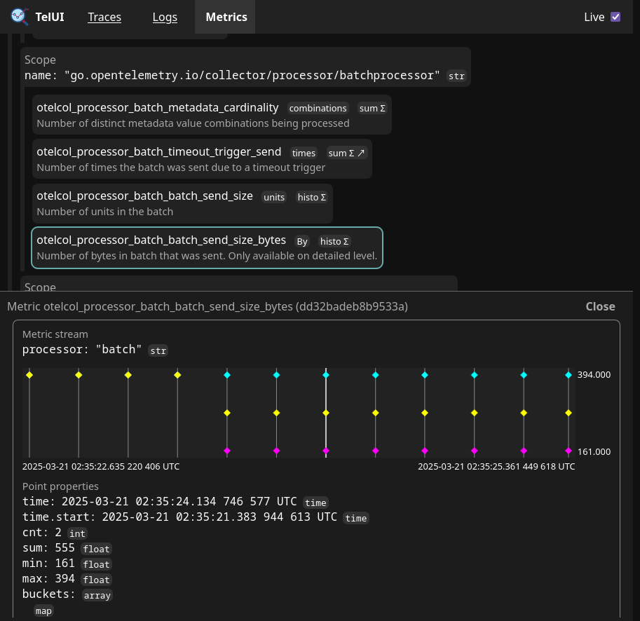

# TelUI

A basic in-memory OpenTelemetry traces/logs/metrics receiver and viewer.

```
Usage of ./telui:
  -grpc int
        Port for OTLP/gRPC server (0 to disable) (default 4317)
  -http int
        Port for OTLP/HTTP server (0 to disable) (default 4318)
  -ui int
        Port for web interface (default 8080)
  -verbose
        Log incoming data
```

## Screenshots







